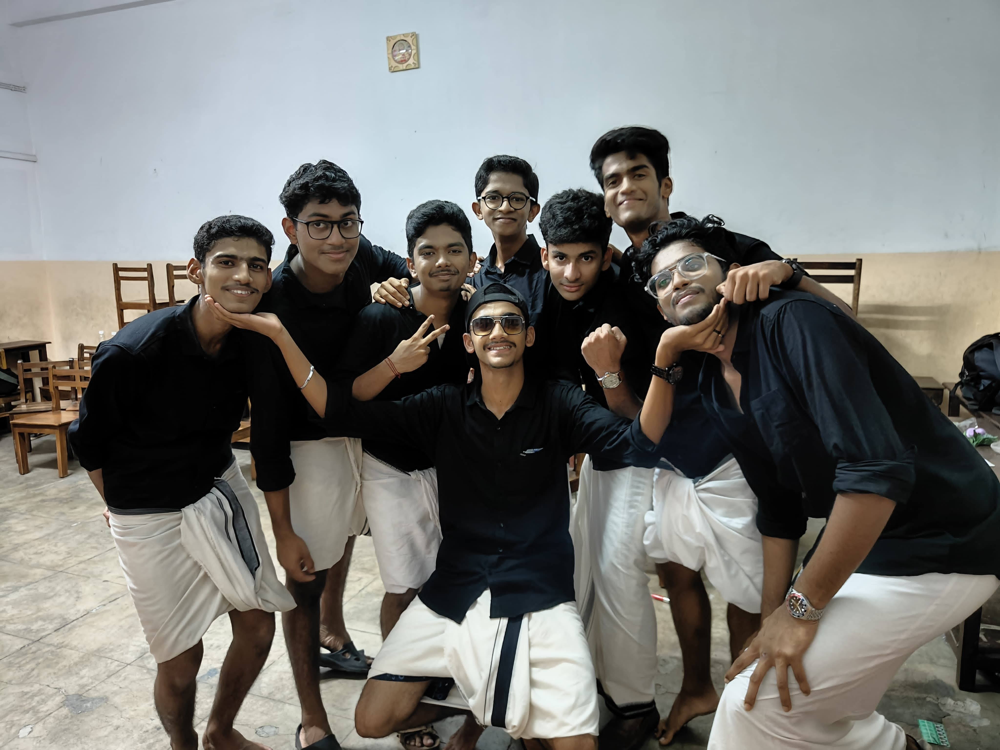

<html lang="en">

<head>
    <meta charset="UTF-8">
    <meta name="viewport" content="width=device-width, initial-scale=1.0">
    <title>Joseph Stalin - Portfolio</title>
    <style>
        body {
            margin: 0;
            padding: 0;
            background: linear-gradient(135deg, #0f2027, #203a43, #2c5364);
            font-family: 'Poppins', sans-serif;
            color: #fff;
            overflow-x: hidden;
        }

        .container {
            text-align: center;
            padding: 60px 20px;
        }

        h1,
        p {
            opacity: 0;
            transform: translateY(30px);
            animation: fadeUp 1s forwards;
        }

        h1 {
            font-size: 3em;
            color: #00ffe7;
            text-shadow: 0 0 15px #00ffe7, 0 0 25px #00ffe7;
            margin-bottom: 20px;
        }

        p {
            font-size: 1.3em;
            margin: 10px 0;
        }

        @keyframes fadeUp {
            to {
                opacity: 1;
                transform: translateY(0);
            }
        }

        .line-1 {
            animation-delay: 0.5s;
        }

        .line-2 {
            animation-delay: 1.5s;
        }

        .line-3 {
            animation-delay: 2.5s;
        }

        .line-4 {
            animation-delay: 3.5s;
        }

        .line-5 {
            animation-delay: 4.5s;
        }

        .line-6 {
            animation-delay: 5.5s;
        }

        /* Profile Image */
        .profile {
            margin: 40px auto;
            width: 180px;
            height: 180px;
            border-radius: 50%;
            overflow: hidden;
            border: 5px solid #00ffe7;
            box-shadow: 0 0 20px #00ffe7, 0 0 40px #00ffe7;
            animation: glowPulse 3s infinite alternate;
        }

        .profile img {
            width: 100%;
            height: 100%;
            object-fit: cover;
        }

        @keyframes glowPulse {
            from {
                box-shadow: 0 0 20px #00ffe7, 0 0 40px #00ffe7;
            }

            to {
                box-shadow: 0 0 40px #00ffe7, 0 0 80px #00ffe7;
            }
        }

        /* Section styling */
        .section {
            margin-top: 100px;
        }

        .section h2 {
            font-size: 2.2em;
            color: #ffcc00;
            text-shadow: 0 0 15px #ffcc00, 0 0 30px #ffcc00;
            margin-bottom: 20px;
        }

        .gallery {
            display: flex;
            justify-content: center;
            gap: 20px;
            flex-wrap: wrap;
            margin-top: 20px;
        }

        .gallery img {
            width: 300px;
            height: 220px;
            border-radius: 15px;
            object-fit: cover;
            box-shadow: 0 0 15px rgba(255, 255, 255, 0.3);
            transition: transform 0.4s ease, box-shadow 0.4s ease;
        }

        .gallery img:hover {
            transform: scale(1.08);
            box-shadow: 0 0 25px #00ffe7, 0 0 45px #00ffe7;
        }

        /* Resume Section */
        .resume {
            max-width: 800px;
            margin: auto;
            text-align: left;
            background: rgba(255, 255, 255, 0.05);
            padding: 30px;
            border-radius: 20px;
            box-shadow: 0 0 20px rgba(0, 0, 0, 0.5);
        }

        .resume h3 {
            color: #00ffe7;
            font-size: 1.8em;
            margin-top: 20px;
        }

        .resume p {
            font-size: 1.1em;
            line-height: 1.6;
        }

        .resume ul {
            margin-left: 20px;
        }

        /* Motivational Section */
        .quote {
            margin: 80px auto;
            font-size: 1.5em;
            font-style: italic;
            max-width: 700px;
            line-height: 1.8;
            color: #ffcc00;
            text-shadow: 0 0 15px #ffcc00;
        }

        /* Floating background */
        .circles {
            position: fixed;
            top: 0;
            left: 0;
            width: 100%;
            height: 100%;
            overflow: hidden;
            z-index: -1;
        }

        .circles li {
            position: absolute;
            display: block;
            list-style: none;
            width: 20px;
            height: 20px;
            background: rgba(255, 255, 255, 0.2);
            animation: animate 25s linear infinite;
            bottom: -150px;
        }

        .circles li:nth-child(1) {
            left: 25%;
            width: 80px;
            height: 80px;
            animation-delay: 0s;
        }

        .circles li:nth-child(2) {
            left: 10%;
            width: 20px;
            height: 20px;
            animation-delay: 2s;
            animation-duration: 12s;
        }

        .circles li:nth-child(3) {
            left: 70%;
            width: 20px;
            height: 20px;
            animation-delay: 4s;
        }

        .circles li:nth-child(4) {
            left: 40%;
            width: 60px;
            height: 60px;
            animation-delay: 0s;
            animation-duration: 18s;
        }

        .circles li:nth-child(5) {
            left: 65%;
            width: 20px;
            height: 20px;
            animation-delay: 0s;
        }

        .circles li:nth-child(6) {
            left: 75%;
            width: 110px;
            height: 110px;
            animation-delay: 3s;
        }

        .circles li:nth-child(7) {
            left: 35%;
            width: 150px;
            height: 150px;
            animation-delay: 7s;
        }

        .circles li:nth-child(8) {
            left: 50%;
            width: 25px;
            height: 25px;
            animation-delay: 15s;
            animation-duration: 45s;
        }

        .circles li:nth-child(9) {
            left: 20%;
            width: 15px;
            height: 15px;
            animation-delay: 2s;
            animation-duration: 35s;
        }

        .circles li:nth-child(10) {
            left: 85%;
            width: 150px;
            height: 150px;
            animation-delay: 0s;
            animation-duration: 11s;
        }

        @keyframes animate {
            0% {
                transform: translateY(0) rotate(0deg);
                opacity: 1;
                border-radius: 0;
            }

            100% {
                transform: translateY(-1000px) rotate(720deg);
                opacity: 0;
                border-radius: 50%;
            }
        }
    </style>
</head>

<body>
    <div class="container">
        <!-- Profile Picture -->
        <div class="profile">
            
        </div>

        <!-- Intro Text -->
        <h1 class="line-1">Hi, I’m Joseph Stalin</h1>
        <p class="line-2">A Student at Rajagiri School of Engineering and Technology</p>
        <p class="line-3">Pursuing B.Tech in AI and Data Science</p>
        <p class="line-4">My hobbies: Football & Gaming</p>
        <b><p class="line-6">Studied at Lords Academy CMI ICSE School :)  </p></b>
        <p class="line-5">I live in Thrissur, Kerala</p>
        

        <!-- School Section -->
        <div class="section">
            <h2>My School Days</h2>
            <div class="gallery">
                
                
                
            </div>
        </div>

        <!-- Resume Section -->
        <div class="section">
            <h2>My Resume</h2>
            <div class="resume">
                <h3>Education</h3>
                <p><strong>B.Tech in Artificial Intelligence & Data Science</strong> - Rajagiri School of Engineering
                    and Technology</p>
                <p><strong>High School</strong> - Lords Academy</p>

                <h3>Skills</h3>
                <ul>
                    <li>Python, C++, Java</li>
                    <li>Machine Learning & Data Analysis</li>
                    <li>Web Development (HTML, CSS, JavaScript)</li>
                    <li>Problem Solving & Teamwork</li>
                </ul>

                <h3>Interests</h3>
                <p>Football, Gaming, Technology, Innovation</p>
            </div>
        </div>

        <!-- Motivational Section -->
        <div class="section">
            <h2>My Motivation</h2>
            <div class="quote">
                “Success is not final, failure is not fatal: it is the courage to continue that counts.”
                <br> — Winston Churchill
            </div>
        </div>
    </div>

    <!-- Floating Background -->
    <ul class="circles">
        <li></li>
        <li></li>
        <li></li>
        <li></li>
        <li></li>
        <li></li>
        <li></li>
        <li></li>
        <li></li>
        <li></li>
    </ul>
</body>

</html>
```
